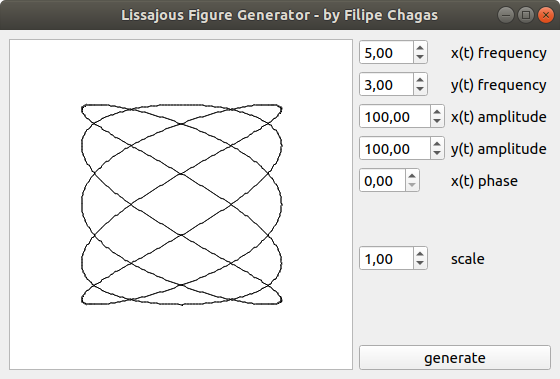

# Lissajous Curves Generator

This is a simple lissajous figure generator in Qt 5.12.11 (C++).

[Lissajous Curve - Wikipedia Article](https://en.wikipedia.org/wiki/Lissajous_curve)

Use Qt Creator IDE to build it. 